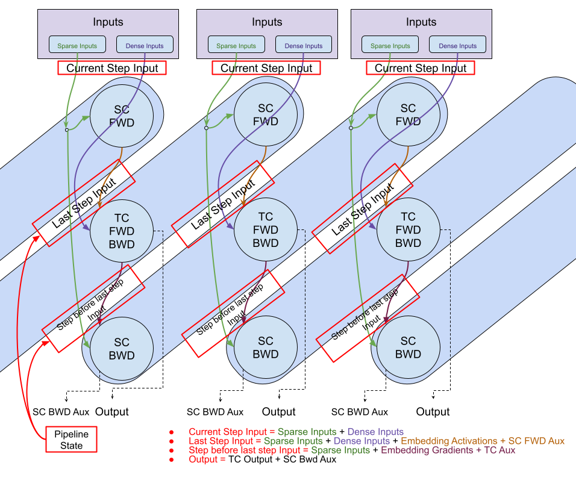

.. currentmodule:: jax_tpu_embedding.sparsecore.lib.nn.embedding_pipelining_utils

Pipelining TensorCore and SparseCore operations
===============================================

This page explains an optimization technique to overlap SparseCore (SC)
embedding computations with the TensorCore (TC) computations to improve training
throughput.

The API provides a :func:`step` function that takes the SparseCore forward pass,
TensorCore forward/backward pass, and SparseCore backward pass functions as
input. The :func:`step` function manages the pipeline state and executes the
functions in the correct order.

The :mod:`embedding_pipelining_utils` module provides utilities for managing
this overlap.

For an example of usage see: `jax_sc_shakespeare_pipelined_jit_test.py <https://github.com/jax-ml/jax-tpu-embedding/tree/main/jax_tpu_embedding/sparsecore/examples/shakespeare/jax_sc_shakespeare_pipelined_jit_test.py>`_

Converting to Pipelined Training
--------------------------------

Turning a non-pipelined training loop into a pipelined one requires moving from
a single step function to a pipelined step function that manages state across
iterations.

**Non-pipelined Training Loop:**

.. code-block:: python

  for step in range(num_steps):
    batch = prepare_batch(step)

    # 1. SparseCore Forward
    sc_activations, _ = sc_fwd_fn(batch.sparse, variables)

    # 2. TensorCore Forward/Backward
    sc_grads, output, state, _ = tc_fn(sc_activations, batch.dense, state)

    # 3. SparseCore Backward (Update)
    variables, _ = sc_bwd_fn(batch.sparse, sc_grads, variables)

    # Process output...

**Pipelined Training Loop:**

.. code-block:: python

  def prepare_input(step_counter):
    if step_counter < num_steps:
      return ep_utils.CurrentStepInput(
          sparse_inputs=fetch_sparse(step_counter),
          dense_inputs=fetch_dense(step_counter),
      )
    else:
      # Provide dummy inputs for pipeline draining steps
      return jax.tree.map(jnp.zeros_like, first_batch_input)

  pipeline_state = ep_utils.get_initial_state(...)

  # Pipelining requires 2 extra steps (filling and draining)
  for step_counter in range(num_steps + 2):
    # Prepare input for the current iteration
    pipeline_input = prepare_input(step_counter)
    fake_tc_step = not ep_utils.is_output_valid(step_counter, num_steps)

    # Single call to ep_utils.step handles all stages
    output, _, state, variables, pipeline_state = ep_utils.step(
        pipeline_input, state, variables, pipeline_state,
        sc_fwd_fn, tc_fn, sc_bwd_fn, fake_tc_step=fake_tc_step)

    if ep_utils.is_output_valid(step_counter, num_steps):
      # Process output from step_counter - 1
      process_metrics(output)

Special handling for boundary steps
------------------------------------

The overlapping execution of SparseCore and TensorCore computations from
different batches requires special handling for the first and last steps of the
training loop.

Skipping TensorCore execution during pipeline filling and draining
^^^^^^^^^^^^^^^^^^^^^^^^^^^^^^^^^^^^^^^^^^^^^^^^^^^^^^^^^^^^^^^^^^

The ``tc_function`` (which runs the main model's forward and backward pass)
should only run when it has valid inputs from the previous step's SC forward
pass, and when its gradients are needed for a future SC backward pass. In the
very first and very last pipeline steps, one of these conditions isn't met.
The flag ``fake_tc_step=True`` is used to skip the actual TC computation in
these steps.

The utility function :func:`is_output_valid` returns ``True`` only for
steps 1 to ``num_steps``, signaling that TC should only run in those steps.

.. code-block:: python

  # Pipeline step 0: filling (SC fwd only)
  # Pipeline steps 1 to num_steps: steady state
  # Pipeline step num_steps + 1: draining (SC bwd only)
  fake_tc_step = not ep_utils.is_output_valid(step_counter, num_steps)

Providing dummy inputs during pipeline draining
^^^^^^^^^^^^^^^^^^^^^^^^^^^^^^^^^^^^^^^^^^^^^^^

We only have ``num_steps`` batches of real input data (0 to ``num_steps-1``).
However, the pipeline requires ``num_steps + 2`` iterations to complete. In the
last two steps (``num_steps`` and ``num_steps+1``), we need to provide dummy
inputs to satisfy the function signatures.

.. code-block:: python

  if step_counter < num_steps:
    pipeline_input = prepare_real_batch(step_counter)
  else:
    # Use zeros_like to provide dummy inputs for extra steps
    pipeline_input = jax.tree.map(jnp.zeros_like, dummy_input_template)

Passing data between stages using auxiliary output (Aux)
--------------------------------------------------------

The SparseCore (SC) and TensorCore (TC) functions can return auxiliary data
(``aux``) that is passed to subsequent stages in the pipeline. This is useful
for passing state or intermediate results that are not part of the primary
training data (like activations or gradients).

* ``sc_fwd_aux``: Returned by the SC forward function. It is passed as an
  argument to the TC function in the *next* pipeline step.
* ``tc_aux``: Returned by the TC function. It is passed as an argument to the
  SC backward function in the *next* pipeline step.
* ``sc_bwd_aux``: Returned by the SC backward function. It is returned as part
  of the :func:`step` function's output and can be used for logging or
  monitoring.

The types of these auxiliary data are defined by the user when instantiating the
stage functions (:class:`ScFwdStageFun`, :class:`TcStageFun`,
:class:`ScBwdStageFun`). By default, if no auxiliary data is needed, ``None``
should be returned.

**Example: Passing metadata from SC Forward to TC**

.. code-block:: python

  def sc_fwd_fn(sparse_inputs, variables):
    # Perform lookup...
    activations = ...
    # Pass metadata (e.g., sequence lengths) to TC
    sc_fwd_aux = {"seq_lengths": sparse_inputs.lengths}
    return activations, sc_fwd_aux

  def tc_fn(activations, dense_inputs, state, sc_fwd_aux):
    # Use metadata from SC Forward
    seq_lengths = sc_fwd_aux["seq_lengths"]
    # ... perform TC computations ...
    return gradients, output, state, tc_aux

Sharding and Performance
------------------------

Efficient pipelining requires correct sharding of the pipeline state and
embedding variables to ensure data is properly distributed across TPU devices
and SparseCores.

Sharding the Pipeline State
^^^^^^^^^^^^^^^^^^^^^^^^^^^

The :class:`PipelineState` object contains buffered inputs and outputs for different
pipeline stages. To avoid unnecessary data copies during training, it is
important to initialize this state with the correct shardings. The helper
function :func:`get_pipeline_state_sharding` generates a sharding structure for
the pipeline state based on the shardings of your dense inputs, sparse inputs,
and model outputs.

.. code-block:: python

  # Define your shardings
  global_sharding = jax.sharding.NamedSharding(mesh, P("data"))
  replicated_sharding = jax.sharding.NamedSharding(mesh, P())

  # Generate pipelined state sharding
  pipeline_state_sharding = ep_utils.get_pipeline_state_sharding(
      pipeline_state_cls=MyPipelineState,
      dense_input_sharding=global_sharding,
      sparse_input_sharding=global_sharding,
      pipeline_output_sharding=MyModelOutput(metrics=replicated_sharding),
      tc_aux_sharding=replicated_sharding,
  )

  # Use this sharding when initializing the pipeline state
  pipeline_state = ep_utils.get_initial_state(...)
  pipeline_state = jax.device_put(pipeline_state, pipeline_state_sharding)

Embedding Table Layout
^^^^^^^^^^^^^^^^^^^^^^

For optimal SparseCore performance, embedding variables should be sharded using
a specific layout that matches the hardware's expectations. The utility function
``embedding_table_format`` (or ``embedding_table_format_with_sharding``) in the
``utils`` module provides this optimized format.

.. code-block:: python

  from jax_tpu_embedding.sparsecore.utils import utils

  # Create an optimized sharding for embedding variables
  emb_sharding = jax.sharding.NamedSharding(mesh, P("data", None))
  emb_layout = utils.embedding_table_format_with_sharding(emb_sharding)

  # Initialize embedding variables with this layout
  emb_variables = embedding.init_embedding_variables(
      key, table_specs, emb_sharding, num_sc_per_device)

Using these shardings in your :func:`jax.jit`'ed train step via ``in_shardings``
and ``out_shardings`` helps JAX optimize the execution and minimize overhead.

Additionally, you can use ``jax.lax.with_sharding_constraint`` inside your
TensorCore function to ensure that activations or intermediate tensors maintain
the desired sharding layout during the computation.

Internal Implementation Details
-------------------------------

This section describes how the pipeline stages overlap and the cycles required
to process multiple batches.

Pipelining works by passing n batches (0 based indexing).

.. note:: Output from ``SC bwd (i-2)`` is used in ``SC fwd (i)``
   i.e. ``[SC BWD (i-2) -> SC FWD i] (SC)`` and ``[TC FWD BWD (i-1)] (TC)`` are
   run in parallel

+-------------+--------------------+-------------------------------+------------+----------------------+
| ``Cycles``  |     ``SC fwd``     |        ``TC fwd/bwd``         | ``SC bwd`` | ``SC bwd -> SC fwd`` |
+=============+====================+===============================+============+======================+
| ``0``       | ``0``              | ``-`` (``fake_tc_step=True``) | ``-``      | ``SC fwd(0)``        |
+-------------+--------------------+-------------------------------+------------+----------------------+
| ``1``       | ``1``              | ``0``                         | ``-``      | ``SC fwd(1)``        |
+-------------+--------------------+-------------------------------+------------+----------------------+
| ``2``       | ``2``              | ``1``                         | ``0``      | ``0 -> 2``           |
+-------------+--------------------+-------------------------------+------------+----------------------+
| ``3``       | ``3``              | ``2``                         | ``1``      | ``1 -> 3``           |
+-------------+--------------------+-------------------------------+------------+----------------------+
| ``...``     | ``...``            | ``...``                       | ``...``    | ``... -> ...``       |
+-------------+--------------------+-------------------------------+------------+----------------------+
| ``n-1``     | ``n-1``            | ``n-2``                       | ``n-3``    | ``n-3 -> n-1``       |
+-------------+--------------------+-------------------------------+------------+----------------------+
| ``n (E)``   | ``-`` (fake input) | ``n-1``                       | ``n-2``    | ``SC bwd(n-2)``      |
+-------------+--------------------+-------------------------------+------------+----------------------+
| ``n+1 (E)`` | ``-`` (fake input) | ``-`` (``fake_tc_step=True``) | ``n-1``    | ``SC bwd(n-1)``      |
+-------------+--------------------+-------------------------------+------------+----------------------+

* ``E``: Extra Steps

API
---

.. autofunction:: step

.. autofunction:: get_initial_state

.. autofunction:: get_pipeline_state_sharding

.. autofunction:: get_pipeline_train_steps

.. autofunction:: is_output_valid

.. autofunction:: get_default_sc_fwd_function

.. autofunction:: get_default_sc_bwd_function

.. autoclass:: PipelineState
   :members:

.. autoclass:: CurrentStepInput
   :members:

.. autoclass:: LastStepInput
   :members:

.. autoclass:: StepBeforeLastStepInput
   :members:

.. autoclass:: ScFwdStageFun
   :members: __call__

.. autoclass:: TcStageFun
   :members: __call__

.. autoclass:: ScBwdStageFun
   :members: __call__
