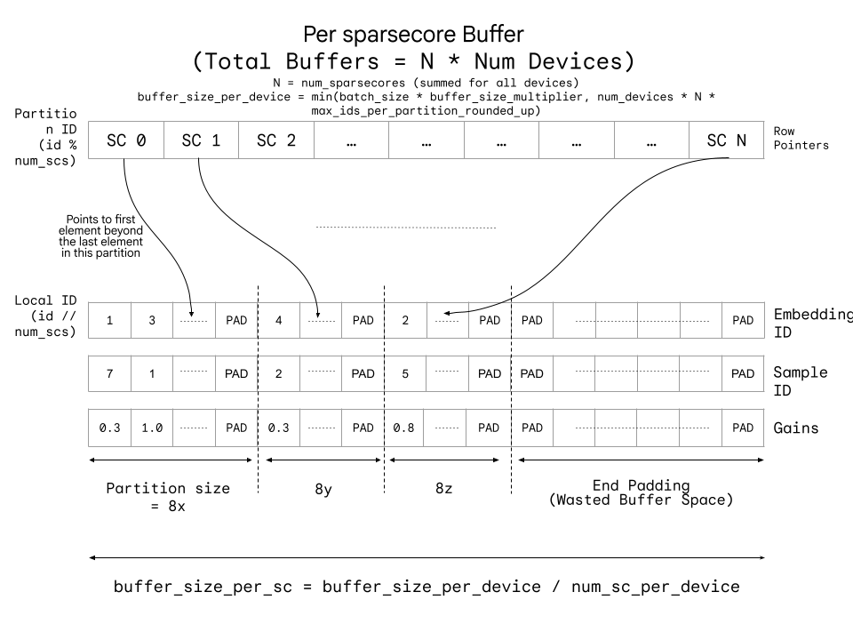

.. currentmodule:: jax_tpu_embedding.sparsecore.lib.nn.embedding

Input Processing
================

The SparseCore accepts sparse inputs (ragged/list of list) packed into a
`COO <https://openxla.org/xla/sparsecore#3_conversion_to_coo_tensors>`__ format
(see below). To convert sparse inputs into this format we provide the
:func:`preprocess_sparse_dense_matmul_input` API.
This function also returns the input statistics to tune :doc:`FDO <advanced/fdo>`.

This preprocessed input can be directly fed to the :func:`tpu_sparse_dense_matmul`
and :func:`tpu_sparse_dense_matmul_grad` functions.

.. warning::

    JIT-ing this function with :func:`jax.jit` does not work.

.. note::

    The resultant preprocess input arrays are instances of :func:`numpy.ndarray`.

If you have an input that looks similar to
`tf.SparseTensor <http://www.tensorflow.org/api_docs/python/tf/sparse/SparseTensor>`__
you can use :func:`preprocess_sparse_dense_matmul_input_from_sparse_tensor`.

Internals
---------

Preprocessed Input format
^^^^^^^^^^^^^^^^^^^^^^^^^

Each SparseCore has its own preprocessed input buffer, all of which are
concatenated for a given device. Each SparseCore has a list of embedding IDs
that require lookup on another SparseCore based on the sharding of embedding
table. This requires a partitioning of these IDs into partitions for each
SparseCore being queried. The buffer for each SparseCore looks something like
this:

    CSR Wrapped COO Buffer per SparseCore

* The row pointers point to the end of the partition for each partition
  (rounded to a multiple of 8).
* The (local) embedding ID are with respect to the queried SparseCore.
* The gains are the weights for the combiner.
* The sample IDs are used to unflatten the list of samples and reconstruct the
  activations and gradients.

Some of the partitions may be empty leading to the wasted buffer space at the
end.

To optimize for memory, it is thus important to utilize the
``suggested_coo_buffer_size_per_device`` FDO parameter.

Algorithm
^^^^^^^^^

The algorithm works as follows for each stacked table:

* COO Extraction:

  * From different input source formats such as :func:`numpy.ndarray`,
    ``tf.SparseTensor`` or ``RaggedTensor`` we create an instance of
    ``AbstractInputBatch`` that combines the samples and their weights.
  * The stacking interleaves the rows for evenly distributing the feature
    samples over the SparseCores. (``feature_stacking_strategy``).

* Sorting and Grouping:

  * The stacked rows are partitioned into ``num_sc_per_device`` chunks and a
    monotonically increasing key (``uint64_t``) corresponding to each COO
    tensor is used to sort and group them into partitions. The key
    prioritizes ``global_sc_id`` then ``local_embedding_id``, while also packing
    the index into the original list.
  * Duplicate ``global_sc_id`` and ``local_embedding_id`` values are de-duped by
    combining gains.
  * FDO stats: ``max_ids_per_partition``, ``max_unique_ids_per_partition`` and
    ``required_coo_buffer_size`` are calculated.

* Filling Buffer:

  * For each SparseCore, the partitions are packed in the above format using
    padding as needed to achieve the correct buffer alignment.
