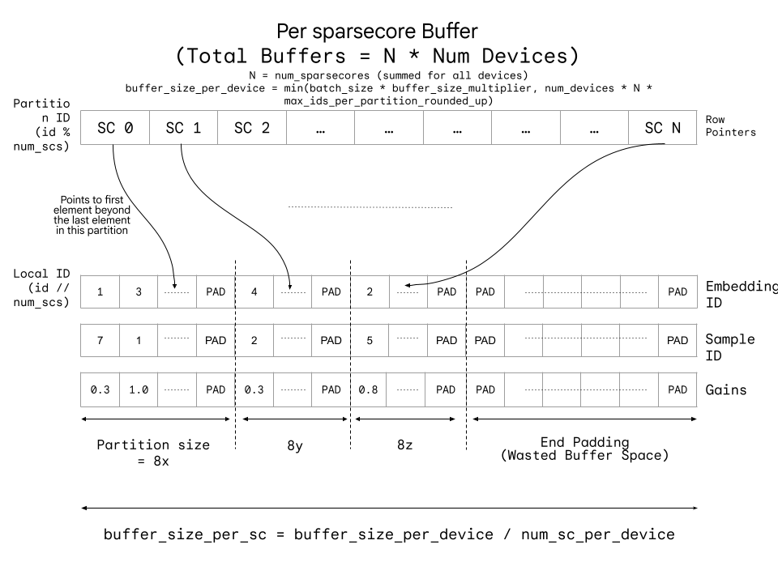

.. currentmodule:: jax_tpu_embedding.sparsecore.lib.nn.embedding

Input Processing
================

The SparseCore accepts sparse inputs (ragged/list of list) packed into a
`COO <https://openxla.org/xla/sparsecore#3_conversion_to_coo_tensors>`__ format
(see below). To convert sparse inputs into this format we provide the
:func:`preprocess_sparse_dense_matmul_input` API.
This function also returns the input statistics to tune :doc:`FDO <advanced/fdo>`.

This preprocessed input can be directly fed to the :func:`tpu_sparse_dense_matmul`
and :func:`tpu_sparse_dense_matmul_grad` functions.

.. warning::

    JIT-ing this function with :func:`jax.jit` does not work.

.. note::

    The resultant preprocess input arrays are instances of :func:`numpy.ndarray`.

If you have an input that looks similar to
`tf.SparseTensor <http://www.tensorflow.org/api_docs/python/tf/sparse/SparseTensor>`__
you can use :func:`preprocess_sparse_dense_matmul_input_from_sparse_tensor`.

Internals
---------

Preprocessed Input format
^^^^^^^^^^^^^^^^^^^^^^^^^

Each SparseCore has its own preprocessed input buffer, all of which are
concatenated for a given device. Each SparseCore has a list of embedding IDs
that require lookup on another SparseCore based on the sharding of embedding
table. This requires a partitioning of these IDs into partitions for each
SparseCore being queried. The buffer for each SparseCore looks something like
this:

    CSR Wrapped COO Buffer per SparseCore

* The row pointers point to the end of the partition for each partition
  (rounded to a multiple of 8).
* The (local) embedding ID are with respect to the queried SparseCore.
* The gains are the weights for the combiner.
* The sample IDs are used to unflatten the list of samples and reconstruct the
  activations and gradients.

Some of the partitions may be empty leading to the wasted buffer space at the
end.

To optimize for memory, it is thus important to utilize the
``suggested_coo_buffer_size_per_device`` FDO parameter.

Algorithm
^^^^^^^^^

The preprocessing algorithm groups the input embedding IDs by the target
SparseCore (based on table sharding) and prepares them for hardware access.
Here is a simplified pseudocode illustrating the core steps:

.. code-block:: python

    def preprocess_for_sparse_core(features, weights, num_sparse_cores, num_sc_per_device):
      # partitions: (local_sc, global_sc) -> dict of {(local_embedding_id, local_row_id): accumulated_weight}
      partitions = collections.defaultdict(lambda: collections.defaultdict(float))

      samples_per_sc = len(features) // num_sc_per_device

      # 1. Partition & De-duplicate
      for sample_id, (sample_features, sample_weights) in enumerate(
          zip(features, weights)
      ):
        # Data parallelism: assign samples to local SparseCores
        local_sc_id = sample_id // samples_per_sc
        local_row_id = sample_id % samples_per_sc

        for embedding_id, weight in zip(sample_features, sample_weights):
          # Model parallelism (sharding): find which SC holds this embedding ID
          global_sc_id = embedding_id % num_sparse_cores
          local_embedding_id = embedding_id // num_sparse_cores

          key = (local_sc_id, global_sc_id)

          # Accumulate weights (gains) for duplicate lookups in the same sample
          partitions[key][(local_embedding_id, local_row_id)] += weight

      # 2. Sort: Each partition must be sorted by embedding ID and sample ID
      sorted_partitions = {
          key: sorted(data.items()) for key, data in partitions.items()
      }

      # 3. Pack: Flatten and align partitions into CSR-wrapped COO buffers
      return pack_to_csr_buffers(sorted_partitions)
